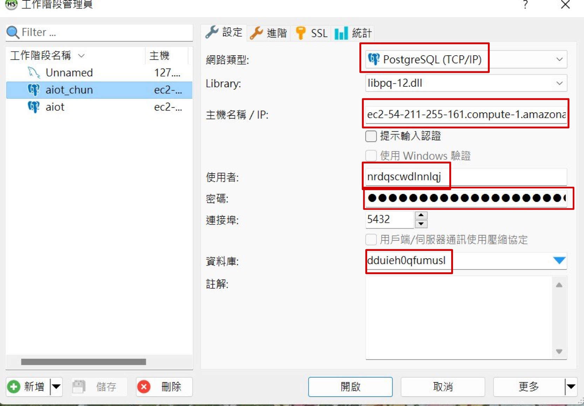
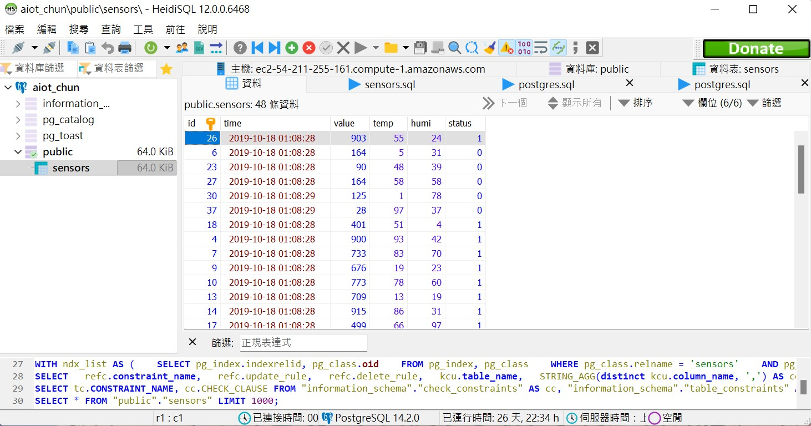
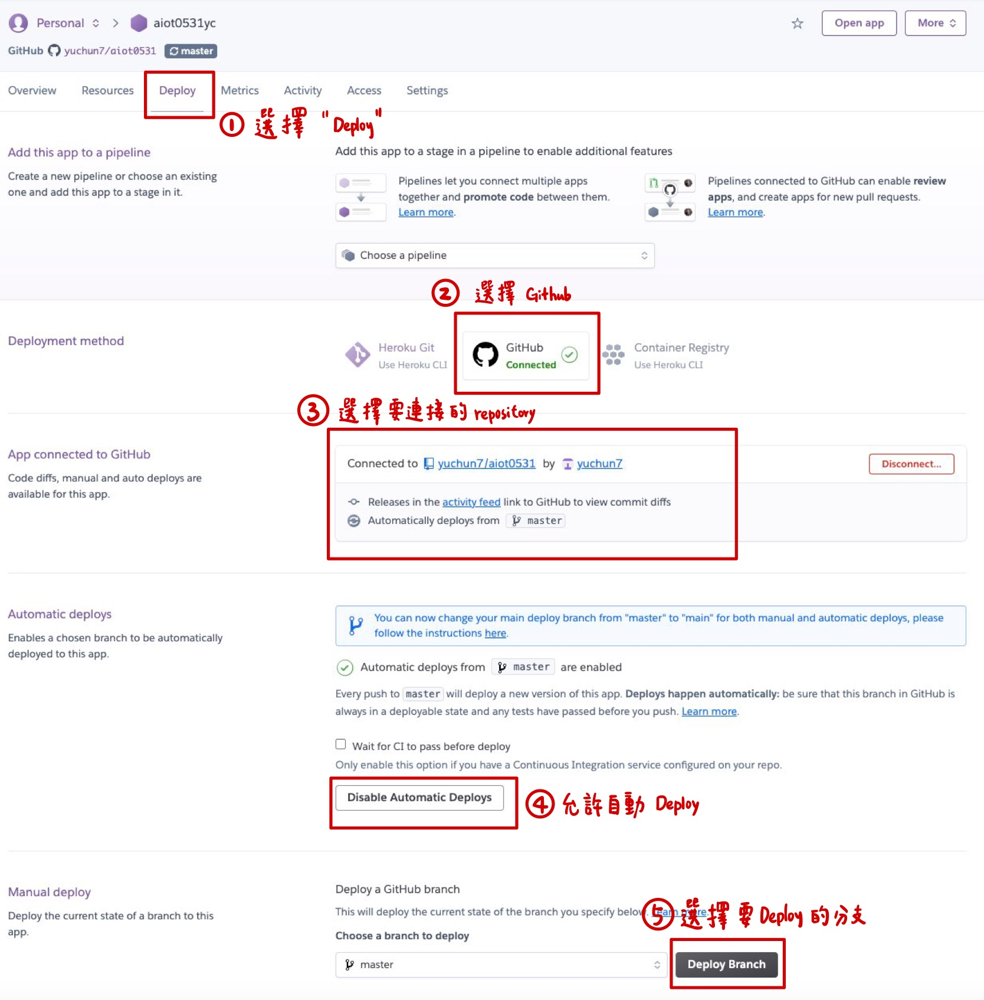
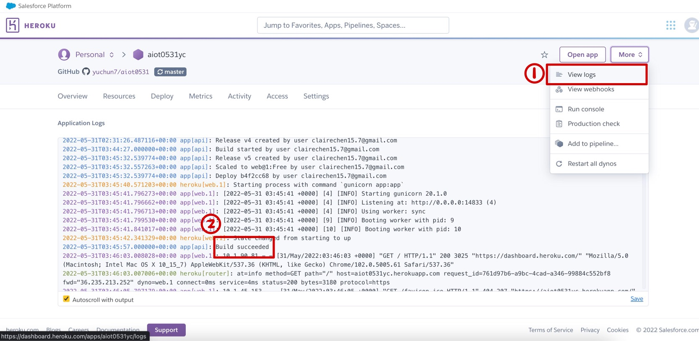
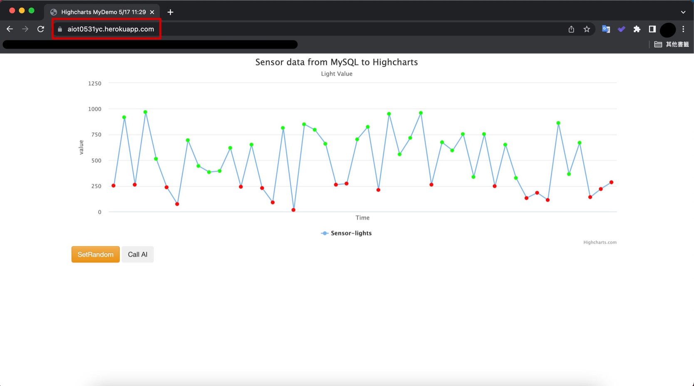
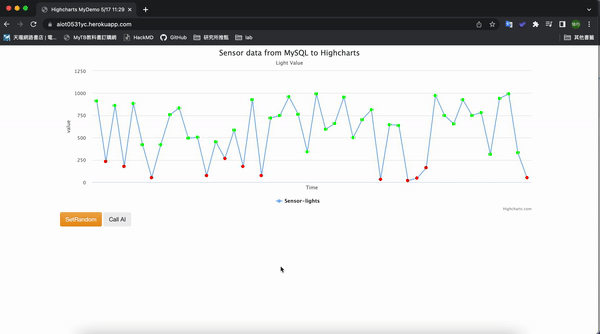
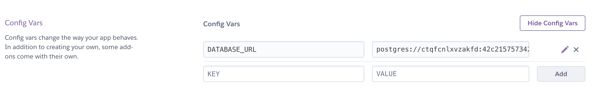

# AIoT Github

## Lecture 16: IoT Flask Web (deploy to heroku)
#### Author: YuChun

### step 0 : 
    註冊 Heroku, github 請下載 HeidiSQL, VS code
    

### step 1 : Clone this github
* git clone https://github.com/huanchen1107/aiot0530-start-no-token 到 local\aiot0531 folder
    * 把local的 \aiot0531\.git 殺掉 (產生自己的git管理員) 方便建立新的git repository 
    * 推送至 github 建立新的 aiot0531 https://github.com/yuchun7/aiot0531.git


### step 2 : install some package


```python
pip insall gunicorn   
Flask==2.0.1 
Jinja2==3.0.1 
psycopg2 
sklearn 
pandas  
numpy 
```

### step 3: add an heroku postgredb

* register heroku account
* go to dashboard
* new an app
* go to resource and add-on an Heroku postgredb
* get your credentials

    
    

### step 4: login to heroku postgredb using HeidiSQL


* Get Your Credentials in heroku and login using HeidiSQL:

```sql
myserver ="<fill-in-Heroku-Postgredb-DB-sever>"
myuser="<fill-in-Heroku-Postgredb-DB-user>"
mypassword="<fill-in-Heroku-Postgredb-DB-pwd>"
mydb="<fill-in-Heroku-Postgredb-DB-db>"

```
**Create!**


### step 5: import postgredb (in db/postgre.db)
 public >> 檔案 >> 載入 SQL 檔案 >> 選擇 "postgres.sql"


### step 6: setting db in app.py

Fill in the code using your heroku Postgredb credentials.


```sql
myserver ="<fill-in-Heroku-Postgredb-DB-sever>"
myuser="<fill-in-Heroku-Postgredb-DB-user>"
mypassword="<fill-in-Heroku-Postgredb-DB-pwd>"
mydb="<fill-in-Heroku-Postgredb-DB-db>"

```

### step 7: testing locally by running python app.py

```
python app.py
```


### step 8: deploy to github (new public github repositoy 不然看不到)



delete .git and git remote add origin master github.com/xxxxx


### step 9: Heroku deploy from github
可以從 view logs 看 deploy 的情況


### step 10: Complete


Sample link 1:
https://awinlab-aiot.herokuapp.com/

Sample link 2: 
https://aiot0529.herokuapp.com/

My link:
https://aiot0531yc.herokuapp.com/



---

## 遇到的問題：

Heroku 晚上寄送 Email 

> Your database DATABASE_URL on aiot0531yc requires maintenance. During this period, your database will become read-only. Once maintenance has completed, your database credentials and hostname will have changed, but we will update your app's config variables accordingly to reflect the new database connection string .
>

說明 database credentials 和 hostname 將被更改，因此改用 DATABASE_URL去取得 postgresql database 中的資料。方法為：
* 進入 heroku >> setting >> Config vars
* 複製 DATABASE_URL 的 value

* 在 app.py 檔案中新增一個 DATABASE_URL 的參數，參數內容就是剛剛複製的 value
    ```
    DATABASE_URL = "<fill-in-Heroku-config-value>"
    ```
* 將 app.py 中會用到 credential 的地方(就是 myserver, myuser, mypassword, mydb 那些參數) 刪除或註解掉，並用 DATABASE_URL 這個參數替代。也就是將原本的 conn 參數修改為：
    ```
    conn = psycopg2.connect(DATABASE_URL)
    ```
參考資料：https://stackoverflow.com/questions/51954574/heroku-maintenance-has-changed-my-database-url-i-have-access-to-a-foreign-db